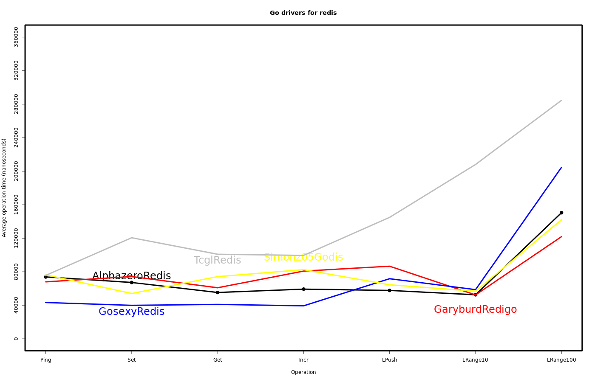
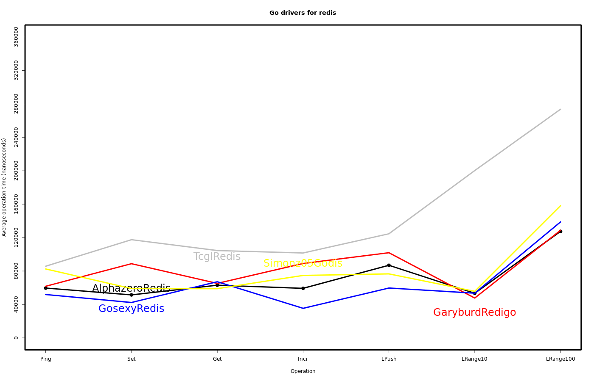
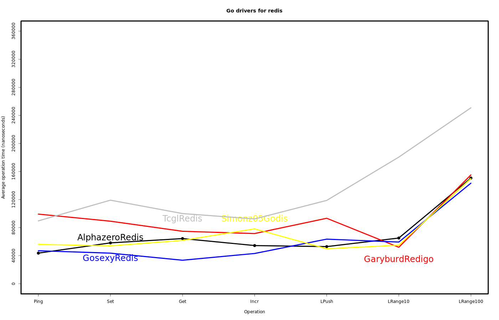
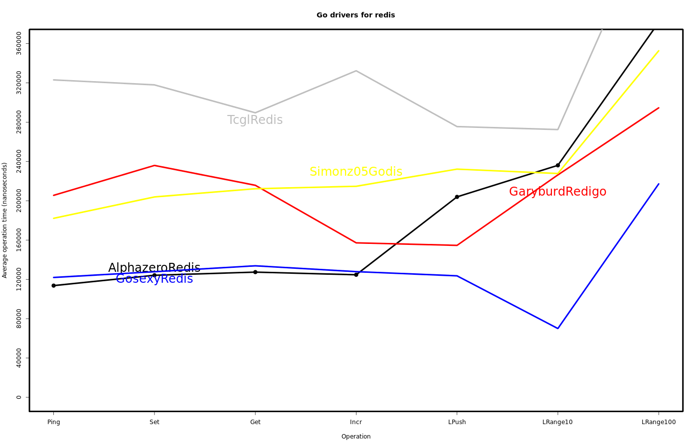
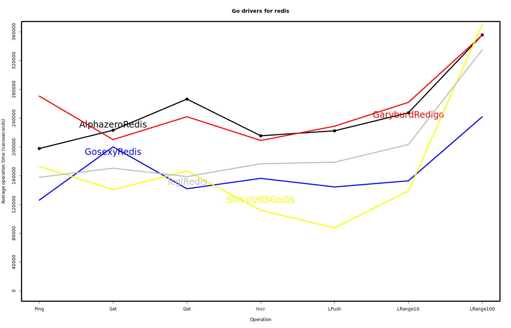
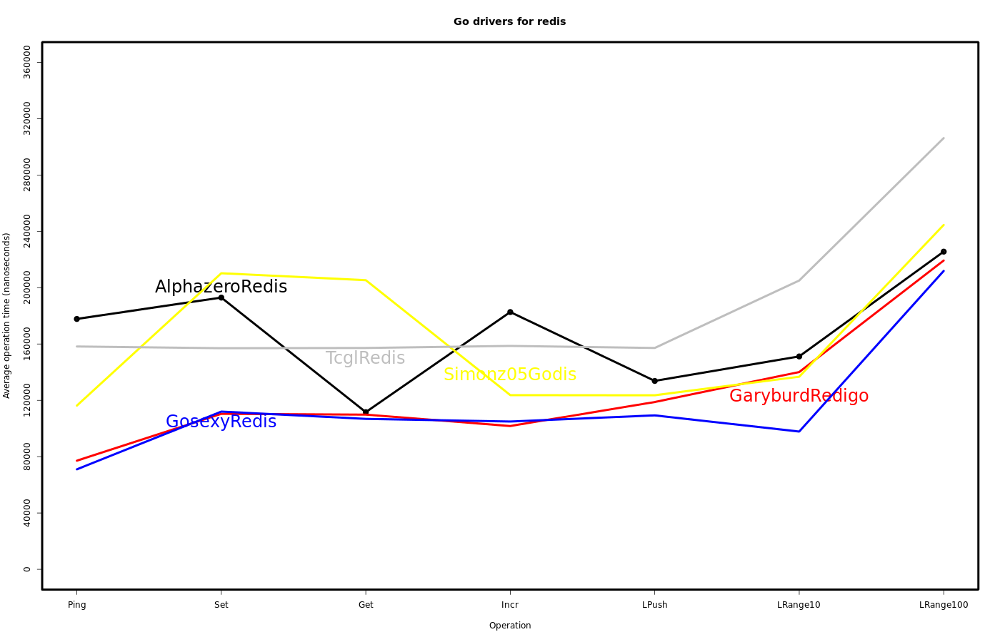

# Benchmarking Go drivers for redis

A comparison between well known Go drivers for redis.

Benchmarks should not be taken as ultimate proofs of how a program or library
behaves as they may throw mixed results across different hosts and settings.

You can use the available benchmarking tools to reproduce these results in your
own host.

Please see [getong's blog][1] for a related blog post.

## Results

* Ubuntu 12.10 x64 (QEMU virtual host)
* Go version 1.1 (May 13, 2013)
* Redis server 2.4.15

```
# redis.conf
loglevel warning
# Saving to disk disabled.
# save 900
```

Each colored line represent a library executing one function
(PING, SET, GET, INCR, LPUSH, LRANGE) and reading a result from the redis
server.

The height of the line represent the average time in nanoseconds the function
took to execute.

Exhibit A: 4G RAM, 2 cores 2GHz (qemu).

Test #1



Test #2



Test #3




Exhibit B: 16G RAM, 8 cores 2GHz (qemu).

Test #1



Test #2



Test #3



## How to reproduce benchmarking

In order to generate the results plot you'll need the [R][2] programming
language interpreter.

```
# The R programming language
aptitude install r-core
# Version control systems wrapped by go get.
aptitude install mercurial git bzr
```

Then update all the related libraries to their latest version.

```
go get -u code.google.com/p/tcgl/redis
go get -u github.com/alphazero/Go-Redis
go get -u github.com/garyburd/redigo/redis
go get -u github.com/simonz05/godis/redis
go get -u menteslibres.net/gosexy/redis
cd $GOPATH/src/menteslibres.net/gosexy/redis/_benchmarks
```

Finally, use the `./bench.sh` file to run a benchmarking test and generate a
plot.

```
$ ./bench.sh
$ file redis-benchmarks.png
redis-benchmarks.png: PNG image data, 1400 x 900, 8-bit/color RGB, non-interlaced
```

[1]: http://www.cnblogs.com/getong/archive/2013/04/01/2993139.html
[2]: http://www.r-project.org/
