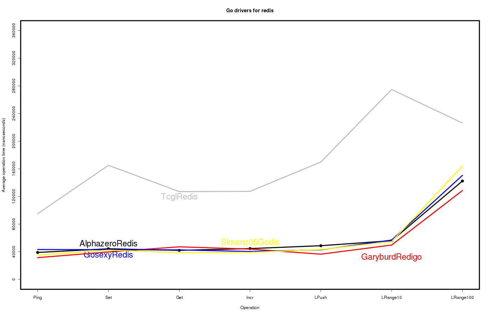
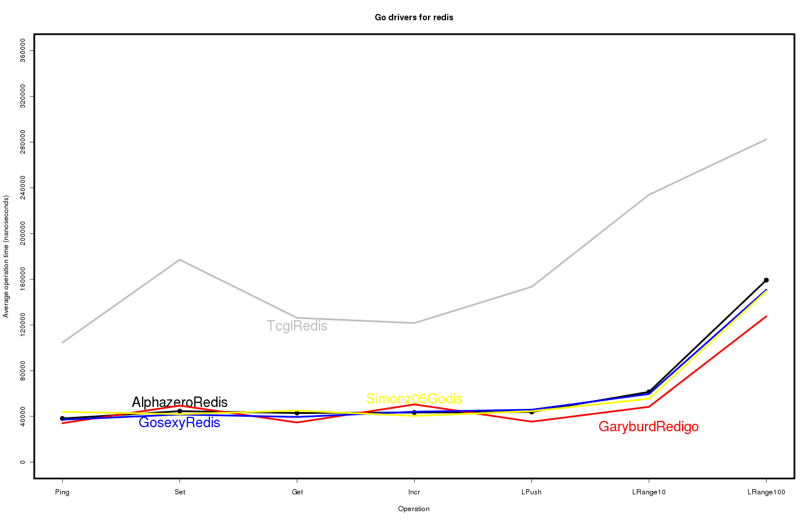
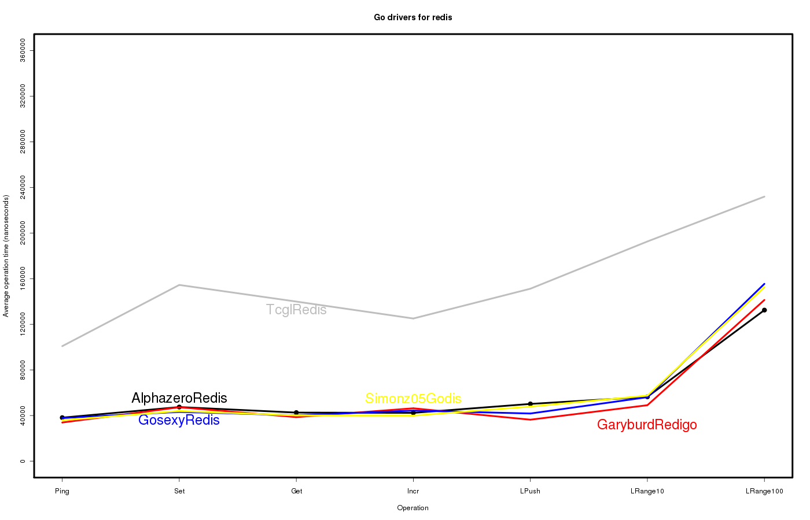
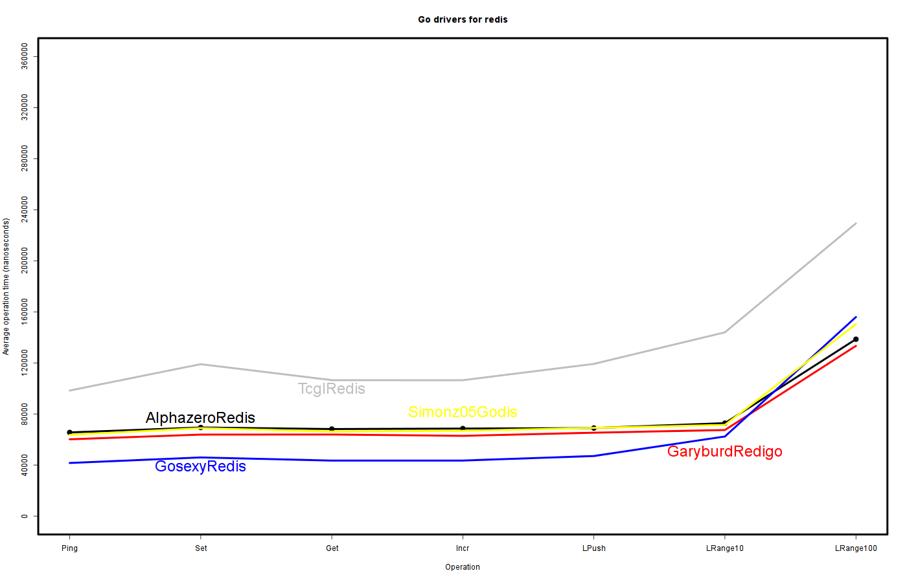
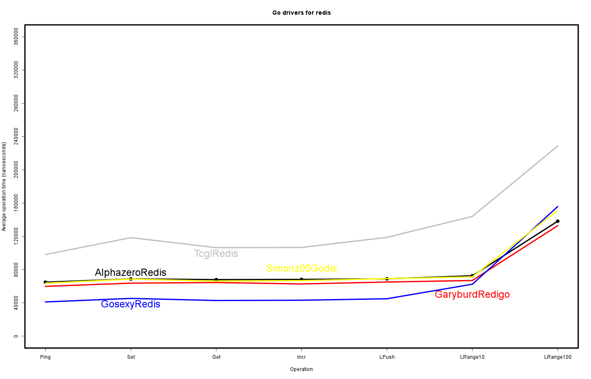
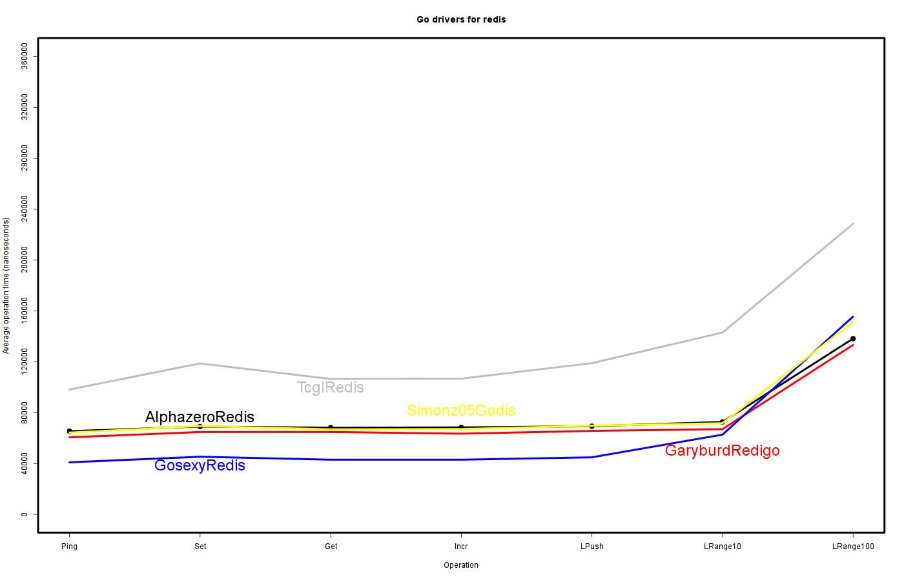
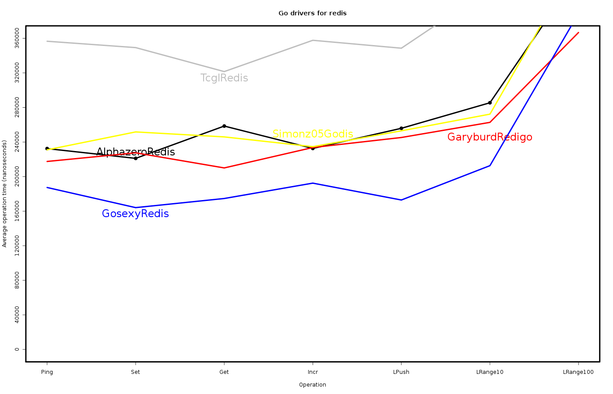
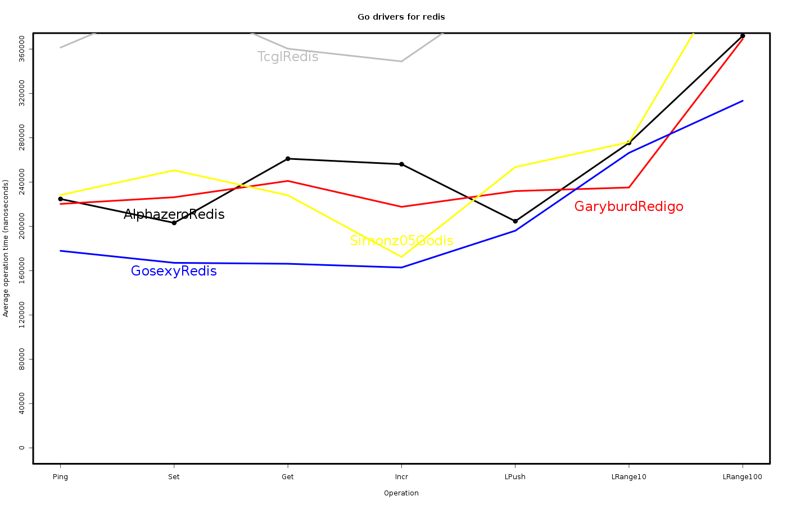
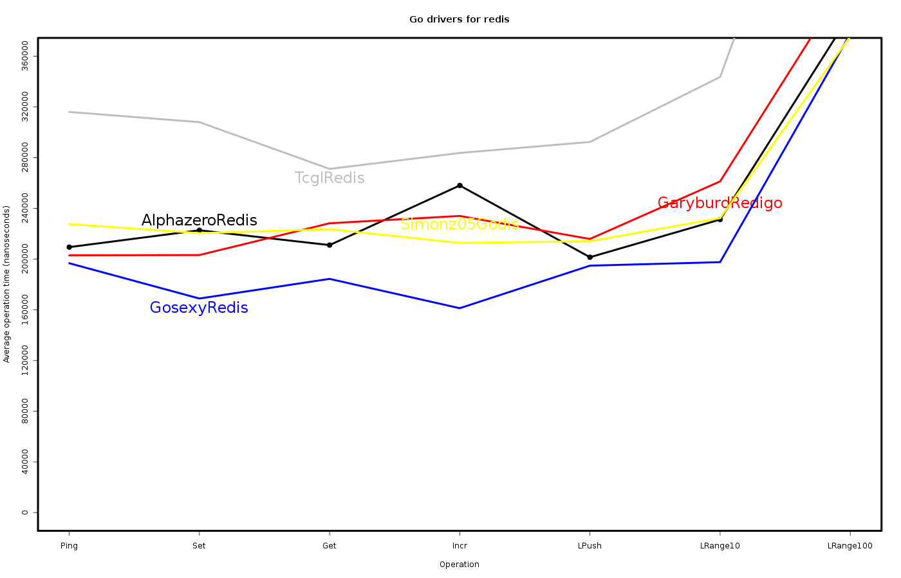

# Benchmarks

Go version 1.0.3 (Apr 20, 2013).

Redis server 2.6.12.

```
# redis.conf
loglevel warning
save ""
```

Each colored line represent a library executing one function
(PING, SET, GET, INCR, LPUSH, LRANGE) and reading a result from the redis
server.

The height of the line represent the average time in nanoseconds the function
took to execute.

Exhibit A: Debian virtual machine 256Mb ram, 1 core 2GHz (qemu).

Test #1



Test #2



Test #3



Exhibit B: OSX host 4G ram, 4 cores 2.3GHz.

Test #1



Test #2



Test #3



Exhibit C: Debian virtual machine 16G ram, 8 cores 2GHz (qemu).

Test #1



Test #2



Test #3


